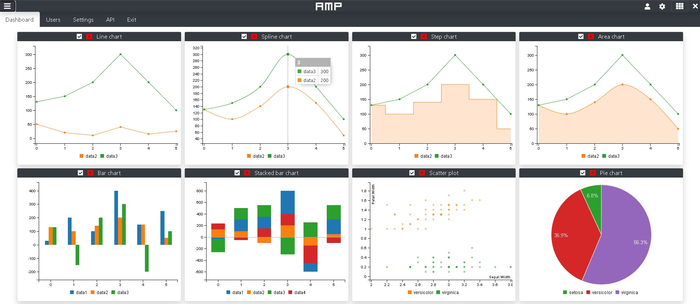
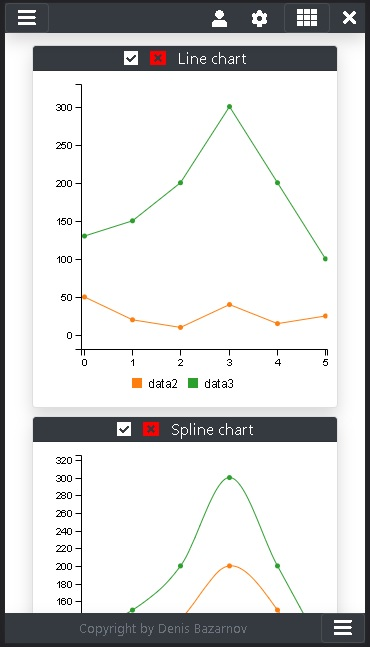

<h1 align="center">AMP: is a fast admin dashboard template based on FastAPI</h1>
<h3 align="center"></h3>

<h1>Introduction</h1>
    AMP: is a fast admin dashboard template based on FastAPI. The project uses its own database sqlite, which allows you to start using immediately after installation. Peewee is used as an ORM. The templates use bootstrap and C3(D3-based reusable chart library). The project implements authorization, user groups, localization and a number of settings, including separate setting of time zones for users.

<h1>Screenshots</h1>
<h3 align="center">Desktop view</h3>

<h3 align="center">Mobile view</h3>
<h3 align="center"></h3>

<h1>Demo</h1>

<h1>Installation</h1>
<ol>
<li> Clone repo. </li>
<li> In workdir: <code> pip install -r requirements.txt </code></li>
<li> in console (in workdir) run: <code>uvicorn main:app --reload</code> </li>
</ol>

<ul>
<li> Username: demo </li>
<li> Password: demo-123 </li>
</ul>

&nbsp;&nbsp;The project also contains Docker files so you can build your image and container.

<h1>License</h1>
This project is licensed under the GPL-3.0 License.
